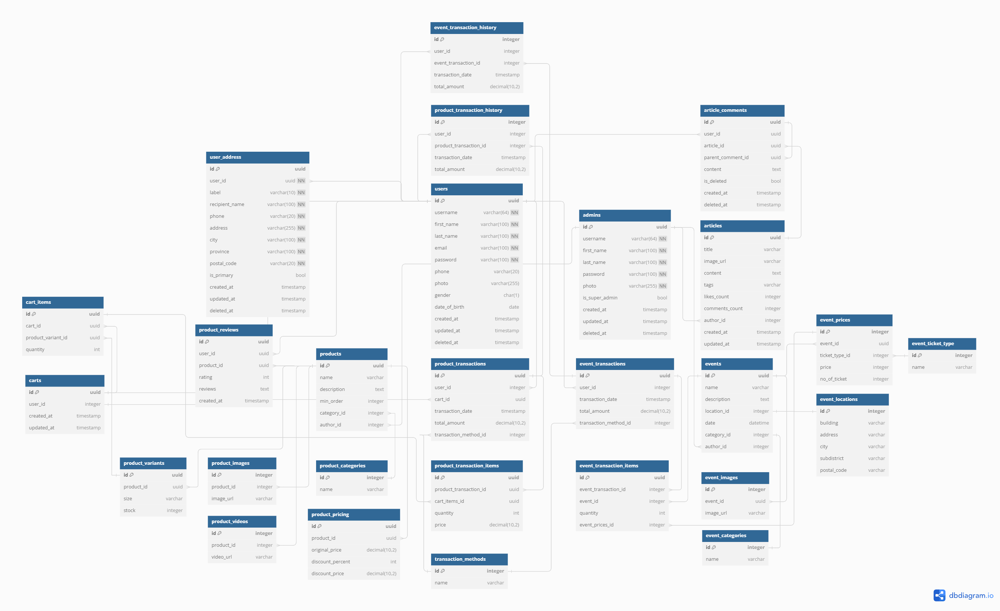
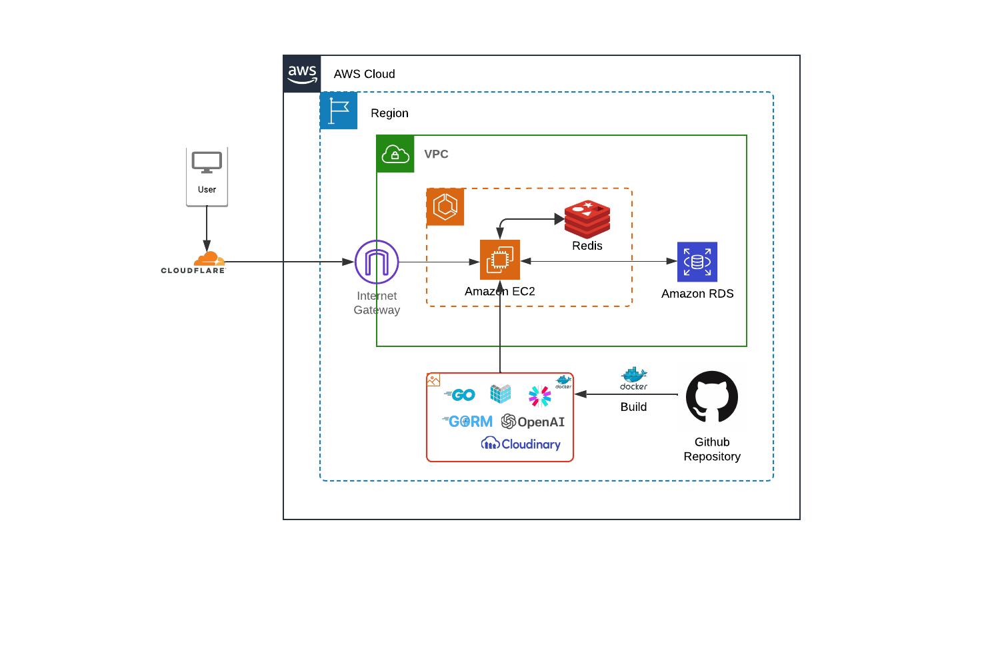

# Kreasi Nusantara

## About Project
***Kreasi Nusantara*** adalah sebuah all-inone platform yang melayani segala keperluan pembelian produk dan pertunjukan lokal, hingga menyajikan berita-berita ter-update terkait Nusantara. Dilengkapi dengan berbagai fitur tambahan seperti chatbot, profile, dan transactions yang membuat aplikasi semakin nyaman untuk digunakan oleh end User.

## Features
### Admin
- Manage Products
- Manage local art & culture events
- Manage articles
- Report prouct transactions
- Import product data

### End User
- View local products
- Read an articles about local art and culture events
- Customer service chatbot (AI)
- Purchase product / event
- Get product recommendation

## Tech Stacks
- [Golang](https://go.dev/)
- [Echo](https://echo.labstack.com/)
- [Gorm](https://gorm.io/index.html)
- [JWT](https://jwt.io/)
- [Cron](https://pkg.go.dev/github.com/robfig/cron)
- [OpenAI](https://openai.com/)
- [Mockery](https://github.com/vektra/mockery)
- [Testify](https://github.com/stretchr/testify)
- [PostgreSQL](https://www.postgresql.org/)
- [Docker](https://www.docker.com/)
- [AWS EC2](https://aws.amazon.com/ec2/)
- [AWS RDS](https://aws.amazon.com/rds/)
- [GitHub Action](https://docs.github.com/actions)

## API Documentation
[Go Chefbot API](https://www.postman.com/kreasi-nusantara/workspace/kreasi-nusantara-api)

## ERD


## HLA


## Setup 

### Getting Started
1. Clone or fork this repository to your local computer.
    ```bash
      git clone https://github.com/capstone-tim-7-alterra/kreasi-nusantara-api.git
    ```
2. Navigate to project directory.
    ```bash
      cd kreasi-nusantara-api
    ```
3. Copy example environment variable to .env file.
    ```bash
      cp .env.example .env
    ```
3. Install the dependencies
    ```bash
      go mod tidy
    ```
4. Run the application
    ```bash
      go run main.go
    ```